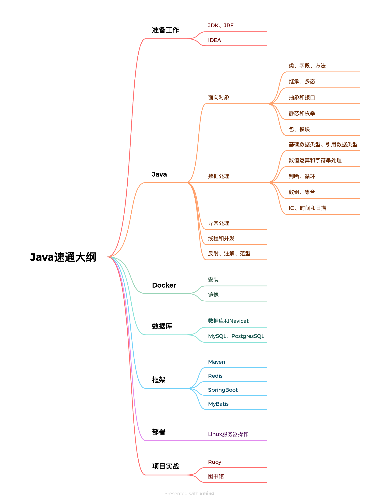

# 前端转全栈之速通JAVA-大纲

以下是我个人基于当下AI能力的高速发展及AI编程对开发者的冲击现状，从一个前端开发者视角对当前生存现状和应对策略的分析。

## 一、行业趋势和转型背景

- 趋势：随着AI技术的发展，编码成本和门槛的不断降低，单纯的前端技能已经不足以应对市场需求，前端开发必须想全栈转型，实现从端到端完整交付的能力。
- 生存危机：结合当下国内就业环境，纯前端开发者的困境很难突破，如不掌握后端技术，有面临被淘汰的风险，甚至失去“玩家资格”。
- 为什么是JAVA：后端开发的选择有很多，如java、Node.js、python等，如果只是兴趣爱好拓宽视野，无论哪个语言都可以。但是想在工作上获得更好的机会，国内市场上只有JAVA这个一个选择。

## 二、 前端速通Java的学习策略

当然抛开我们多年的前端开发经验，从零开始学JAVA也是不科学、不效率的。只有充分利用我们已掌握的前端知识体系，通过比对、分析、差异化学习的方式，帮助我们快速理解Java核心知识点，消化Java的语法、特性以及设计模式等，降低学习门槛，缩短学习时间。
该方法旨在帮助前端开发者在短时间内完成技术栈的补充，实现从前端到全栈的快速转型。

## 三、学习大纲

先叠个甲，以下大纲是我根据我个人的经验和认知，以及自己学习Java时的思考整理出来的大纲，不一定正确，只是个人的思考和总结。
如果不对的、差异的、冲突的地方，一定是我个人的问题，欢迎指正。

根据上述大纲我将学习过程分为以下几个阶段：

#### 1. 准备工作阶段
准备阶段：下载安装JDK、配置环境变量、安装IDEA等。
需要时间：0.5天
进度：5%

#### 2. java基础阶段
java基础阶段：学习java的基本语法、数据类型、运算符、控制流、面向对象编程等。按实时进度可能有13-15个小章节
需要时间：大概10分钟左右阅读时间，以及1小时的练习时间。
进度：60%

#### 3. Docker阶段
Docker阶段：学习Docker的基本概念、安装、配置、使用等。按实时进度可能有1-2个小章节(有经验的可以跳过)
需要时间：大概1天
进度：65%

#### 4. 数据库阶段
数据库阶段：学习MySQL的基本概念、安装、配置、使用等。按实时进度可能有3-5个小章节(有经验的可以跳过)
需要时间：每个章节10分钟，以及1小时练习时间。
进度：75%

#### 5. 框架阶段
框架阶段：学习Maven、Redis、Spring Boot等，按实时进度可能有7个小章节，会结合ruoyi项目来学习
需要时间：大概1天
进度：85%

#### 6. 项目阶段
项目阶段：学习ruoyi项目的代码，理解项目的架构、设计模式、配置等，并且在ruoyi的项目基础上进行二次开发。
需要时间：大概1天
进度：95%

#### 7. 部署阶段
部署阶段：将二次开发后的项目部署到Docker容器中，包括数据库、java服务、redis服务等，能够正常访问。
需要时间：大概1天
进度：100%

## 四、学习思路

1. 保持心态：虽然我们是速通，但也不要急于求成，转型后端开发最大的要求就是耐心和恒心。我要陷入我觉得我会了的错觉，我们的目标是能够看懂Java代码，能够在AI辅助下独立完成项目交付。
2. 检验标准：阅读章节内容，独立完成练习。最终目标是：能够看懂Java代码、理解架构设计（如登录、权限、支付、统计等业务模块），并具备利用AI完成项目开发的能力。
3. 学习方法：
