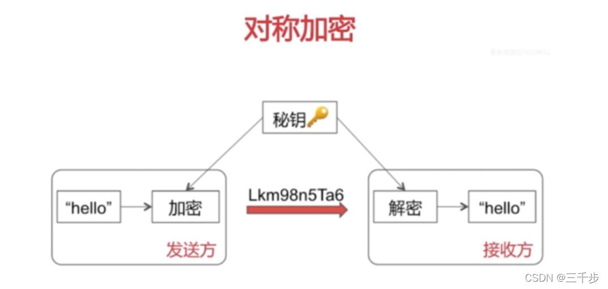
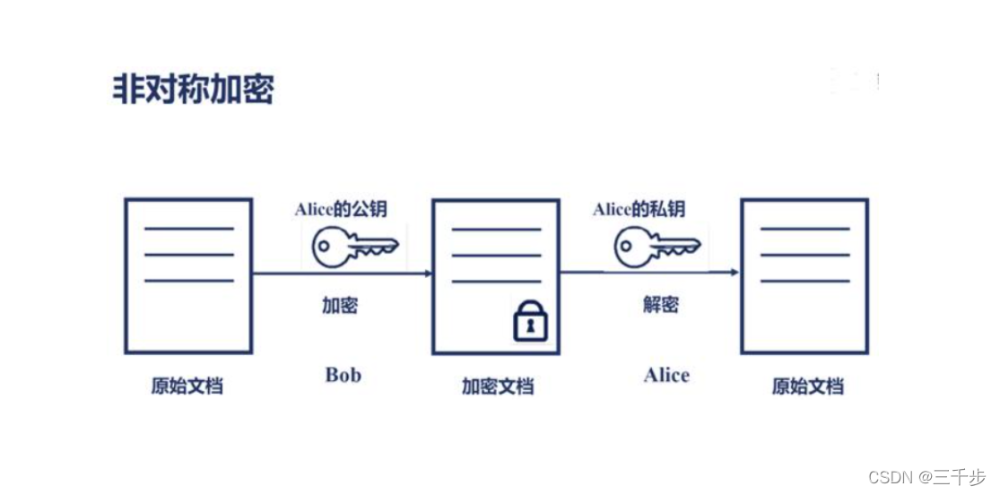
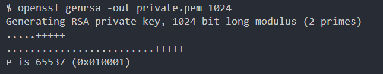
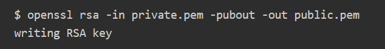

# 对称加密和非对称加密

## 前言

在信息安全领域，加密技术是保护数据不被未授权访问的关键手段。加密算法主要分为对称加密和非对称加密两大类，它们在加密和解密过程中使用不同的密钥。本文将详细介绍对称加密和非对称加密的区别、工作原理、优缺点以及它们在实际应用中的场景。

## 对称加密

- 概念：
  加密算法是公开的，靠的密钥来加密数据，发送方和接收方使用相同的密钥加密，也必然使用相同的密钥解密
- 优点：
  算法公开、计算量小、加密速度快、加密效率高。
- 缺点：
  在数据传送前，发送方和接收方必须商定好秘钥，然后使双方都能保存好秘钥。
- 常见算法：
  DES、3DES、Blowfish、IDEA、RC4、RC5、RC6 和 AES



### AES 加解密 （crypto-js）

使用 crypto-js 加密库，实现 AES 对称加密。AES 有多种加密模式，本文仅介绍基于 ECB 和 CBC 的加密（填充算法采用 PKCS7）。

- **_ECB_**：电码本模式（Electronic Codebook Book）。将整个明文分成若干段相同的小段，然后对每一小段进行加密。
- **_CBC_**：密码分组链接模式（Cipher Block Chaining）。先将明文切分成若干小段，然后每一小段与初始块或者上一段的密文段进行异或运算后，再与密钥进行加密。

`crypto-js` 引用脚本为：

```html
<script src="http://cdn.bootcdn.net/ajax/libs/crypto-js/4.0.0/crypto-js.js"></script>
```

#### AES-256-ECB

本算法使用 256 位密钥，即 32 字节。通常情况下，将 43 位字符串进行 Base64 解码即可获得 32 字节密钥，但某些随机字符可能 Base64 解码长度非 32 字节。

```js
/**
 * AES-256-ECB对称加密
 * @param text {string} 要加密的明文
 * @param secretKey {string} 密钥，43位随机大小写与数字
 * @returns {string} 加密后的密文，Base64格式
 */
function AES_ECB_ENCRYPT(text, secretKey) {
	var keyHex = CryptoJS.enc.Base64.parse(secretKey);
	var messageHex = CryptoJS.enc.Utf8.parse(text);
	var encrypted = CryptoJS.AES.encrypt(messageHex, keyHex, {
		mode: CryptoJS.mode.ECB,
		padding: CryptoJS.pad.Pkcs7,
	});
	return encrypted.toString();
}

/**
 * AES-256-ECB对称解密
 * @param textBase64 {string} 要解密的密文，Base64格式
 * @param secretKey {string} 密钥，43位随机大小写与数字
 * @returns {string} 解密后的明文
 */
function AES_ECB_DECRYPT(textBase64, secretKey) {
	var keyHex = CryptoJS.enc.Base64.parse(secretKey);
	var decrypt = CryptoJS.AES.decrypt(textBase64, keyHex, {
		mode: CryptoJS.mode.ECB,
		padding: CryptoJS.pad.Pkcs7,
	});
	return CryptoJS.enc.Utf8.stringify(decrypt);
}
```

#### AES-256-CBC

CBC 模式的向量，做了一个特殊处理，使用密钥的前 16 个字节。如果有特殊要求，可以参考下面示例代码进行调整。

```js
/**
 * AES-256-CBC对称加密
 * @param text {string} 要加密的明文
 * @param secretKey {string} 密钥，43位随机大小写与数字
 * @returns {string} 加密后的密文，Base64格式
 */
function AES_CBC_ENCRYPT(text, secretKey) {
	var keyHex = CryptoJS.enc.Base64.parse(secretKey);
	var ivHex = keyHex.clone();
	// 前16字节作为向量
	ivHex.sigBytes = 16;
	ivHex.words.splice(4);
	var messageHex = CryptoJS.enc.Utf8.parse(text);
	var encrypted = CryptoJS.AES.encrypt(messageHex, keyHex, {
		iv: ivHex,
		mode: CryptoJS.mode.CBC,
		padding: CryptoJS.pad.Pkcs7,
	});
	return encrypted.toString();
}

/**
 * AES-256-CBC对称解密
 * @param textBase64 {string} 要解密的密文，Base64格式
 * @param secretKey {string} 密钥，43位随机大小写与数字
 * @returns {string} 解密后的明文
 */
function AES_CBC_DECRYPT(textBase64, secretKey) {
	var keyHex = CryptoJS.enc.Base64.parse(secretKey);
	var ivHex = keyHex.clone();
	// 前16字节作为向量
	ivHex.sigBytes = 16;
	ivHex.words.splice(4);
	var decrypt = CryptoJS.AES.decrypt(textBase64, keyHex, {
		iv: ivHex,
		mode: CryptoJS.mode.CBC,
		padding: CryptoJS.pad.Pkcs7,
	});
	return CryptoJS.enc.Utf8.stringify(decrypt);
}
```

## 非对称加密

- 概念：
  加密和解密使用不同的秘钥，一把公开的公钥，一把私有的私钥。公钥加密的信息只有私钥才能解密，私钥加密的信息只有公钥才能解密。
- 优点：
  安全，即使密文被拦截、公钥被获取，但是无法获取到私钥，也就无法破译密文。作为接收方，务必要保管好自己的密钥。
- 缺点：
  加密算法及其复杂，安全性依赖算法与密钥，而且加密和解密效率很低。
- 常见算法：
  RSA、DSA、ECC
- 工作流程：
  A 生成一对非对称秘钥，将公钥向所有人公开，B 拿到 A 的公钥后使用 A 的公钥对信息加密后发送给 A，经过加密的信息只有 A 手中的私钥能解密。这样 B 可以通过这种方式将自己的公钥加密后发送给 A，两方建立起通信，可以通过对方的公钥加密要发送的信息，接收方用私钥解密信息。



### RSA 加解密（JSEncrypt.js）

jsencrypt 就是一个基于 rsa 加解密的 js 库

#### RSA 秘钥生成

网络上有很多在线生成密钥的工具网站，为了保证安全最好还是在自己的终端上通过命令行生成，主要调用 openssl 开源加密库，其中**_MMac 系统内置 OpenSSL(开源加密库),可以直接在终端上使用命令。Windows 系统可以安装使用 git 命令行工具_**

- **_生成私钥_**

```shell
openssl genrsa -out private.pem 1024
```

执行结果如下：


- **_从私钥中提取公钥_**

```shell
openssl rsa -in private.pem -pubout -out public.pem

```

同时还可以通过`JSEncrypt.js`生成密钥对

引入 jsencrypt

```
npm install jsencrypt
import JSEncrypt from 'jsencrypt'

```

或者 CDN

```html
<script src="https://cdn.bootcdn.net/ajax/libs/jsencrypt/3.3.2/jsencrypt.min.js"></script>
```

生成密钥对

```js
// 生成密钥对
const createRSAKeys = () => {
	// 生成一个新的 RSA 密钥对，长度为 8192 位（可以调整这个数字）
	const rsaKeypair = KEYUTIL.generateKeypair("RSA", 1024);
	// 提取公钥和私钥
	const publicKey = KEYUTIL.getPEM(rsaKeypair.pubKeyObj);
	const privateKey = KEYUTIL.getPEM(rsaKeypair.prvKeyObj, "PKCS8PRV");
	pulic_key = publicKey;
	private_key = privateKey;
	console.log(pulic_key);
	console.log(private_key);
};
```

#### RSA 加解密

将上面方法生成的密钥对赋值到 `pulic_key` 和 `private_key` 变量中，介绍来就可以对文本进行加解密了。

```js
/**
 * RSA非对称加密
 */
let pulic_key = "";
let private_key = "";
const RSA_encrypt = (text) => {
	const encrypt = new JSEncrypt();
	encrypt.setPublicKey(pulic_key);
	return encrypt.encrypt(text);
};
const RSA_decrypt = (encrypted) => {
	const decrypt = new JSEncrypt();
	decrypt.setPrivateKey(private_key);
	return decrypt.decrypt(encrypted);
};
```

执行结果如下

上述两个命令生成的密钥对文件`private.pem`、`public.pem`如下图


## 参考

[AES 对称加密（crypto-js）](https://segmentfault.com/a/1190000039192480)
[前端 RSA 加解密 JSEncrypt.js](https://www.cnblogs.com/mengzekun/p/17279035.html)
