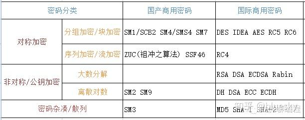

# 国密算法

## 介绍

国密算法，即国家商用密码算法。是由国家密码管理局认定和公布的密码算法标准及其应用规范，其中部分密码算法已经成为国际标准。如 SM 系列密码，SM 代表商密，即商业密码，是指用于商业的、不涉及国家秘密的密码技术。

下表列举常用的国际与国产商密：


## 算法介绍

### SM1

对称加密算法中的分组加密算法，其分组长度、秘钥长度都是 128bit，算法安全保密强度跟 AES 相当，但是算法不公开，仅以 IP 核的形式存在于芯片中，需要通过加密芯片的接口进行调用。

采用该算法已经研制了系列芯片、智能 IC 卡、智能密码钥匙、加密卡、加密机等安全产品，广泛应用于电子政务、电子商务及国民经济的各个应用领域(包括国家政务通、警务通等重要领域)。

### SM2

可以理解为国产 RSA。非对称加密。

基于椭圆曲线密码的公钥密码算法标准，其秘钥长度 256bit，包含数字签名、密钥交换和公钥加密，用于替换 RSA/DH/ECDSA/ECDH 等国际算法。可以满足电子认证服务系统等应用需求，由国家密码管理局于 2010 年 12 月 17 号发布。

SM2 椭圆曲线公钥密码算法是我国自主设计的公钥密码算法，包括 SM2-1 椭圆曲线数字签名算法，SM2-2 椭圆曲线密钥交换协议，SM2-3 椭圆曲线公钥加密算法，分别用于实现数字签名密钥协商和数据加密等功能。SM2 算法与 RSA 算法不同的是，SM2 算法是基于椭圆曲线上点群离散对数难题，相对于 RSA 算法，256 位的 SM2 密码强度已经比 2048 位的 RSA 密码强度要高，但运算速度快于 RSA。

### SM3

可以理解为国产 MD5。消息摘要。可以用 MD5 作为对比理解。该算法已公开。校验结果为 256 位。

是一种密码杂凑算法,用于替代 MD5/SHA-1/SHA-2 等国际算法，适用于数字签名和验证、消息认证码的生成与验证以及随机数的生成，可以满足电子认证服务系统等应用需求，于 2010 年 12 月 17 日发布。

它是在 SHA-256 基础上改进实现的一种算法，采用 Merkle-Damgard 结构，消息分组长度为 512bit，输出的摘要值长度为 256bit。

### SM4

可以理解为国产 AES。无线局域网标准的分组数据算法。对称加密，密钥长度和分组长度均为 128 位。

是我国自主设计的分组对称密码算法，用于替代 DES/AES 等国际算法。SM4 算法与 AES 算法具有相同的密钥长度、分组长度，都是 128bit。于 2012 年 3 月 21 日发布，适用于密码应用中使用分组密码的需求。

### SM7

该算法没有公开

是一种分组密码算法，分组长度为 128 比特，密钥长度为 128 比特。SM7 适用于非接触式 IC 卡，应用包括身份识别类应用(门禁卡、工作证、参赛证)，票务类应用(大型赛事门票、展会门票)，支付与通卡类应用（积分消费卡、校园一卡通、企业一卡通等）。

### SM9

一种标识密码(IBE)算法，由国家密码管理局于 2016 年 3 月 28 日发布，相关标准为“GM/T 0044-2016 SM9 标识密码算法”。主要用于用户的身份认证。SM9 的加密强度等同于 3072 位密钥的 RSA 加密算法。

SM9 算法不需要申请数字证书，适用于互联网应用的各种新兴应用的安全保障。如基于云技术的密码服务、电子邮件安全、智能终端保护、物联网安全、云存储安全等等。这些安全应用可采用手机号码或邮件地址作为公钥，实现数据加密、身份认证、通话加密、通道加密等安全应用，并具有使用方便，易于部署的特点，从而开启了普及密码算法的大门。

### ZUC 祖冲之算法

祖冲之序列密码算法是中国自主研究的流密码算法,是运用于移动通信 4G 网络中的国际标准密码算法,该算法包括祖冲之算法(ZUC)、加密算法(128-EEA3)和完整性算法(128-EIA3)三个部分。目前已有对 ZUC 算法的优化实现，有专门针对 128-EEA3 和 128-EIA3 的硬件实现与优化

### 总结

密码算法作为国家战略资源，比历史上任何时候都显得更为关键。在大数据和云计算的时代，关键信息往往通过数据挖掘技术在海量数据中获得，所以每一个人的信息保护都非常重要。

## 应用与经验 - JavaScript

本文使用基于 js 封装的国密库[sm-crypto](https://github.com/JuneAndGreen/sm-crypto)
项目导入：`npm i sm-crypto`
GIT 地址：[git](https://github.com/JuneAndGreen/sm-crypto)

### SM2 加解密实现

首先生成密钥对：

```js
let publicKey = "";
let privateKey = "";
const generateKeypaire = () => {
	const keyPair = sm2.generateKeyPairHex();
	publicKey = keyPair.publicKey;
	privateKey = keyPair.privateKey;
};
```

然后使用 SM2 的加解密代码如下：

```js
const doms = {
	// sm2
	textSM2Input: document.getElementById("sm2-plain-text"),
	textSM2Encrypt: document.getElementById("sm2-cipher-text"),
	textSM2Decrypt: document.getElementById("sm2-decrypt-text"),
};

// 1 - C1C3C2，0 - C1C2C3，默认为1
const cipherMode = 1;
const sm2Encrypt = () => {
	const text = doms.textSM2Input.value;
	const encrypted = sm2.doEncrypt(text, publicKey, cipherMode);
	doms.textSM2Encrypt.value = encrypted;
};

const sm2Decrypt = () => {
	const text = doms.textSM2Encrypt.value;
	const decrypted = sm2.doDecrypt(text, privateKey, cipherMode);
	doms.textSM2Decrypt.value = decrypted;
};
```

### SM4 加解密实现

首先生成 key，key 需要是 16 进制串或字节数组，要求为 128 比特。

```js
// 可以为 16 进制串或字节数组，要求为 128 比特
const secretKey = generateRandomBytes128();
const secretIv = generateRandomBytes128();

// 生成16 进制串或字节数组
function generateRandomBytes128() {
	if (
		typeof window !== "undefined" &&
		window.crypto &&
		window.crypto.getRandomValues
	) {
		// 浏览器环境
		const byteArray = new Uint8Array(16);
		window.crypto.getRandomValues(byteArray);
		// 如果是字节数组直接返回 byteArray
		// return byteArray;
		const hexSting = Array.from(byteArray, (byte) =>
			byte.toString(16).padStart(2, "0")
		).join("");
		// 如果是16 进制串 hexSting
		return hexSting;
	} else if (typeof require === "function") {
		// Node.js 环境
		const crypto = require("crypto");
		const randomBuffer = crypto.randomBytes(16);
		// 如果是字节数组直接返回 randomBuffer
		// return randomBuffer;
		return randomBuffer.toString("hex");
	} else {
		throw new Error("当前环境不支持生成随机字节");
	}
}
```

SM4 加解密代码如下：

```js
const doms = {
	// sm4
	textSM4Input: document.getElementById("sm4-plain-text"),
	textSM4Encrypt: document.getElementById("sm4-cipher-text"),
	textSM4Decrypt: document.getElementById("sm4-decrypt-text"),
};
const sm4Encrypt = () => {
	const text = doms.textSM4Input.value;
	const encrypted = sm4.encrypt(text, secretKey);
	doms.textSM4Encrypt.value = encrypted;
};
const sm4Decrypt = () => {
	const text = doms.textSM4Encrypt.value;
	const decrypted = sm4.decrypt(text, secretKey);
	doms.textSM4Decrypt.value = decrypted;
};

const cbcConfig = {
	mode: "cbc",
	iv: secretIv,
};

const sm4CBCEncrypt = () => {
	const text = doms.textSM4Input.value;
	const encrypted = sm4.encrypt(text, secretKey, cbcConfig);
	doms.textSM4Encrypt.value = encrypted;
};
const sm4CBCDecrypt = () => {
	const text = doms.textSM4Encrypt.value;
	const decrypted = sm4.decrypt(text, secretKey, cbcConfig);
	doms.textSM4Decrypt.value = decrypted;
};
```

## 参考

[国密算法概述 - 更详细的算法介绍](https://blog.csdn.net/wang_jing_jing/article/details/121493025)
[国密算法介绍](https://zhuanlan.zhihu.com/p/132352160)
[国密算法](https://cloud.tencent.com/developer/article/2421525)
